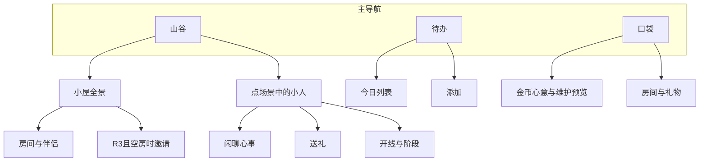

# Productivity Valley — 产品设计文档

> 状态：**锁定批准 v0.4**（2026-07-30）  
> 风格关键词：绘本画风 · 中式小人 · 乙游养成 · 简单易用 · 任务驱动的家园经营  
> 平台：Web 先行，验证后向跨端迁移  
> 说明：本版为实装前的产品基准；规则变更需升版本号并记录于 §15

---

## 1. 产品愿景

**Productivity Valley** 是一款「完成真实待办 → 获得金币与心意 → 经营绘本山谷、与小人发展友情/爱情」的生产力乙游。

玩家通过完成现实中的任务积累金币与社交精力，布置小屋、和多位 NPC 培养关系；感情到位且有空房时，可邀请对方搬入成为**伴侣**。远期把山谷扩展成小镇。画面温暖、操作极简，奖励明确可见。

一句话定位：

> 把每天的小事，变成山谷里亮着的灯，和愿意留下来的人。

---

## 2. 设计支柱

| 支柱 | 含义 |
|------|------|
| **真实产出驱动** | 金币与「心意」（社交精力）主要来自完成待办，乙游养成不另开刷材料副本 |
| **绘本可读性** | 像翻绘本一样一眼看懂：房间、人物、关系阶段都有明确画面语言 |
| **负担透明** | 每位入住伴侣都会带来维护成本；玩家始终知道「养得起吗」 |
| **多线情感** | 可同时与多名 NPC 发展友情与爱情；不强迫单线攻略 |
| **成长可扩展** | MVP 是「小屋 + 伴侣」；远期是「小镇」——家人 vs 镇民规则从第一天就分清 |
| **低摩擦** | 添加任务、完成任务、聊天/送礼、邀入宅，都在 1–2 步内完成 |

---

## 3. 核心循环


日常节奏：

1. 写下今天的待办并完成 → 金币与心意落下  
2. 用心意与山谷里的小人聊天，或花金币送礼 → 友情/爱情推进  
3. 攒钱买带床位的房间；爱情到位 + 有空房 → 邀请搬入成为伴侣  
4. 每日结算伴侣维护费；不够则软提示「山谷有点拮据」  

---

## 4. 世界结构：家 → 山谷 → 小镇

### 4.1 家（Home）— MVP 核心

玩家拥有一座小屋，由若干**房间**组成。

- 房间占用格子（见 §5）  
- **空房间**才能住人  
- 住在家里的人 = **伴侣（Partner）**（乙游关系达标后邀请入住）  
- 伴侣的吃喝等维护费由**玩家承担**  
- 文档里「家人」与「伴侣」同指入住人口；对外文案优先用「伴侣 / 一起住的人」

### 4.2 山谷（Valley）— 视觉舞台

绘本式俯视/斜 45° 小场景：小屋、小路、树、天气。  
山谷是情绪与反馈的主舞台，不在 MVP 做复杂探索。

### 4.3 小镇（Town）— 远期扩展

玩家可在山谷外规划地块、建房，吸引**镇民（Townsfolk）**搬入。

| | 伴侣 Partner | 镇民 Townsfolk |
|--|-------------|----------------|
| 住哪 | 自家房间 | 镇上玩家建的房 |
| 怎么来 | 乙游爱情达标 + 空房邀请 | 建房后搬入（P1） |
| 谁养 | 玩家支付维护费 | **不需要玩家养** |
| 意义 | 温馨、陪伴、消耗与故事 | 繁荣感、解锁城镇氛围 |
| MVP | ✅ | ❌（只预留概念与数据结构扩展点） |

扩展原则：**先把「家里养人」做扎实，再开放「镇上建房」**。避免 MVP 同时做两套经济。

---

## 5. 房间系统

### 5.1 房间是什么

房间 = 可购买的功能单元，同时决定：

1. **居住容量**（能否住人、住几人）  
2. **功能加成**（对任务/金币/维护的温和 buff）  
3. **绘本画面块**（插画模块，拼进小屋）

### 5.2 MVP 房间目录（数值 v1）

| 房间 | 造价 | 容量 | 功能 | 维护相关 |
|------|------|------|------|----------|
| 起居室 | 初始免费 | 0 | 小屋必需；展示家人日常 | — |
| 卧室 | 80 | 1 | 可住人 | 住人后触发该人维护费 |
| 客房 | 100 | 1 | 可住人；入住更偏「客人」旁白 | 同卧室 |
| 厨房 | 120 | 0 | 全体家人「吃」−20% | 功能型 |
| 书房 | 150 | 0 | 完成「中/大」难度待办额外 +10% 金币 | 功能型 |
| 储藏间 | 60 | 0 | 全体「日用」−1（每人） | 功能型 |

餐厅等 P1 再加。数值依据见 §7.5 纸面模拟。

### 5.3 购买规则

- 金币足够 + 尚有建筑空位 → 可买  
- 购买后立即出现在小屋平面图/侧视图中  
- **只有带容量的房间空置时，才能邀请新人**

### 5.4 空房逻辑（关键规则）

```
可邀请伴侣上限 = Σ(带居住容量房间的空位数) - 当前伴侣数
```

另需该 NPC 爱情 ≥ R3（见 §6）。分开住 → 房间变空 → 停维护；感情保留，达标后可再邀。

---

## 6. 乙游模块与伴侣

### 6.1 定位

在生产力主循环之上，增加轻量**乙游养成**：与多名小人同时发展**友情**与**爱情**。  
**入住不再是商店式点选**，唯一路径是：

> 爱情阶段达到「眷恋」＋ 家中有空房 ＋ 支付安家费 → 邀请成为伴侣并搬入。

允许同时攻略多人、同时拥有多名伴侣（只受空房与维护费约束）。不做嫉妒惩罚、不做强制单恋（保持轻松绘本气质）。

### 6.2 角色题材与可攻略池

**已定：中式小人绘本风**——圆脸、略夸张头身比；服饰与道具走淡彩年画/童话国风（布衣、发带、油纸伞、糖葫芦、书匣等），**不是**仙侠战斗立绘，也不是西式奇幻。

全员可走友情 + 爱情线。NPC 库扩展为 **12 人**，要求：**中式人物 + 个性鲜明**（一眼能记住「这个人和其他人不一样」）。

#### 角色库（v1）

| id | 名字 | 鲜明个性（一句话） | 辨识道具 / 外观 | 说话气质 | 喜好礼物 |
|----|------|-------------------|-----------------|----------|----------|
| `shendu` | 沈渡 | 话少，却总在渡口等人；送人上路时才会多说一句 | 竹篙、短蓑衣 | 短句、留白多 | 草鞋绳、热姜汤 |
| `qinghe` | 青禾 | 直球务实，讨厌弯弯绕；答应的事隔夜必办 | 稻穗发饰、泥点裤脚 | 大声、干脆 | 新镰刀坠、麦香饼 |
| `guwan` | 顾晚 | 毒舌护短；嘴上嫌麻烦，雨天已经把伞撑过来了 | 油纸伞、半旧护腕 | 损你两句再关心 | 糖炒栗子、伞骨油 |
| `linchu` | 林初 | 手笨心诚的小木匠；搞砸了也会刨完最后一刀 | 刨花沾衣、尺矩挂腰 | 道歉很快、认真解释 | 好木料角、墨斗 |
| `jiangxiaoman` | 姜小满 | 厨房冒失鬼；口味偏甜，面粉像会自己打架 | 面粉手印、歪系围裙 | 咋咋呼呼又柔软 | 桂花糖、食谱残页 |
| `baizhi` | 白芷 | 冷静采药人；怕吵，能把草认到叶子背面 | 药篓、草本标本夹 | 轻声、精确 | 新研钵、蜜渍橘皮 |
| `chenshi` | 陈拾 | 碎嘴义气的捡漏摊主；八卦灵通，护友要命 | 钱袋、补丁马褂 | 连珠炮、爱起外号 | 古怪小玩意、酒酿丸子 |
| `suweiming` | 苏未名 | 把身边人写进话本的浪漫不着调；常迟到 | 毛笔、未装订纸卷 | 半文半白、爱比喻 | 朱砂印泥、夜航船故事 |
| `yueqingshan` | 岳青衫 | 纪律怪早起习武；其实怕打雷，雷声里会找人待着 | 青布劲衣、木剑 | 规矩、不自觉放软 | 绑带、暖豆袋 |
| `taotao` | 桃桃 | 乐天糖画匠；见谁都想画一只小兔送礼 | 铜勺、糖丝粘发 | 笑语多、叠词 | 麦芽糖块、红纸 |
| `wenjiu` | 温九 | 旧宅式沉稳；记性好到可怕，温柔里带着不计较的锋利 | 钥匙串、深蓝罩衫 | 慢条斯理、一针见血 | 陈年茶饼、布巾 |
| `hedeng` | 河灯 | 感伤却不沉溺；爱放河灯，相信小事也能照路 | 小河灯、湿裤管 | 轻、像在说给水听 | 烛泪蜡、莲纸 |

#### 出场与辨识规则

- **开局可见 6 人**（山谷日常）：沈渡、青禾、顾晚、姜小满、陈拾、桃桃  
- **其余 6 人**随进度遇见（如买下书房/厨房、连续登录、友情阶段解锁传闻）：林初、白芷、苏未名、岳青衫、温九、河灯  
- 每人必须具备：**独特口头禅或行为癖 + 专属道具色块**，避免「换发型的同一张脸」  
- 剧情语气跟角色走，不统一成甜腻系统腔  

玩家视角默认第二人称「你」；不强制声明玩家性别。MVP 不做真人联机。

### 6.3 双轨好感：友情 / 爱情

每位 NPC 独立维护两条进度（阶段制，避免裸分数焦虑；底层可用隐藏分）：

**友情**

| 阶段 | 名称 | 解锁 |
|------|------|------|
| F0 | 路过 | 默认；山谷可见剪影 |
| F1 | 相识 | 日常闲聊短句 |
| F2 | 好友 | 更长心事；可赠「友情向」礼物暴击 |
| F3 | 挚友 | 专属友情小故事；爱情线加速（送礼/聊天友情加成） |

**爱情**（需先达到 **F2 好友**，再通过「心意选择」开线，避免刚见面就告白）

| 阶段 | 名称 | 解锁 |
|------|------|------|
| R0 | 未开线 | — |
| R1 | 好感 | 微表情、脸红小动作 |
| R2 | 心动 | 双人小剧情（短旁白 + 立绘姿态） |
| R3 | 眷恋 | **可邀请搬入成为伴侣** |
| R4 | 同心 | 仅入住后可达；小屋内互动台词 |

阶段阈值（隐藏分，v1）：F1=20 / F2=50 / F3=90；R1=30 / R2=70 / R3=120；R4 入住后累积 +80。

### 6.4 互动：聊天、送礼、心意

**心意（Bond）**：社交精力货币，**主要来自完成待办**。

| 来源 | 心意 |
|------|------|
| 完成小/中/大待办 | +1 / +2 / +3 |
| 每日自然回复 | +1（上限不叠到夸张） |
| 日存储上限 | **10**（防囤积刷一天清完） |

| 互动 | 消耗 | 效果 |
|------|------|------|
| 闲聊 | 心意 1 | 友情 +；已开爱情线时少量爱情 + |
| 心事（F2+） | 心意 2 | 更大友情 +；概率触发短剧情 |
| 表白开线 | 心意 2 | F2 后可选；R0→R1 |
| 送礼 | 金币 15–40（按礼物） | 对口礼物：爱情 + 为主；错喜好：友情小幅 + |
| 入住后「一起喝杯茶」 | 心意 1 | 推进 R4；绘本小互动 |

每日对**同一 NPC** 有效互动上限 **3 次**（防单日刷满阶段）。  
礼物在口袋商店购买，先买进「口袋」再赠送。

### 6.5 邀请为伴侣 / 分开住

| 动作 | 条件 | 结果 |
|------|------|------|
| 邀请为伴侣 | 该 NPC 爱情 ≥ R3 眷恋；有空房；安家费 **20** | 占用 1 床位；身份=伴侣；次日起算维护；爱情可向 R4 |
| 分开住 | 二次确认 | 释放房间；停维护；NPC 回山谷；**好感不清零**（冻结，不因分开惩罚） |

文案示例（随角色变奏，以下为中性底稿）：

- 邀请：「房间收拾好了。要不要……留下来？」  
- 分开：「先各自住一阵，山谷里还能见面。」  
- 角色变奏例：顾晚「哈，终于肯留？伞我可只带一把。」／青禾「行。那明日炊火我来。」  

**不可**对未开爱情线或未达 R3 的角色直接「买进门」。

### 6.6 维护费（入住伴侣）

每位**已入住伴侣**每日消费：

| 条目 | 说明 | 基础值（/人/日） |
|------|------|------------------|
| 吃 | 食物 | 8 |
| 喝 | 饮料 | 3 |
| 日用 | 杂项 | 2 |
| **合计** | | **13** |

修正：

- 厨房：吃 ×0.8  
- 储藏间：日用 −1（最低 0）  
- 有厨+储时：约 **10.4 / 人/日**  
- 人数线性相加；每日结算（本地 0 点或当日首登补结算）  
- 仅山谷未入住的 NPC **不收**维护费  

### 6.7 金币不够付维护时

不做「游戏结束」。软压力：

1. 「今天的罐头有点紧……多完成几件小事吧。」  
2. 伴侣绘本表情略忧愁  
3. 连续欠费 → 暂停部分房间 buff；**不强制分开住**  
4. 玩家可主动请伴侣分开住以减负  

原则：**催促行动，不羞辱用户；乙游关系不被经济系统粗暴删除。**

### 6.8 内容体量（MVP vs P1）

| | MVP | P1 |
|--|-----|-----|
| 角色 | 中式库 **12 人**（开局 6 + 遇见 6），全可攻略 | 节气皮肤、新角色、群像线 |
| 剧情 | 每阶段 2–4 句**角色声口**旁白 + 姿态变化 | 多分支 CG / 长篇约会 |
| 开线 | 手动「心意选择」 | 角色专属条件开线（如岳青衫需雷雨夜事件） |
| 同居 | 邀请 + 小屋互动 | 伴侣间群像小事件 |

---

## 7. 待办与金币经济

### 7.1 待办

极简字段：

- 标题（必填）  
- 可选：难度（小 / 中 / 大）→ 影响金币  
- 可选：标签（专注 / 家务 / 运动…）→ 与书房等房间联动  

交互：勾选完成 → 金币飞入 → 可撤销（撤销扣回金币，已花掉则不允许撤销或进入负余额提示）。

### 7.2 金币来源（MVP）

| 来源 | 规则 |
|------|------|
| 完成待办 | 小 **10** / 中 **25** / 大 **50** |
| 书房加成 | 中/大完成时 ×1.1（四舍五入） |
| 每日首登 | **5**（安慰奖，可关） |
| 连击完成 | MVP **关闭**（降低规则噪音） |

### 7.3 金币去向

- 买房间  
- 买礼物（乙游）  
- 邀请安家费（20）  
- 每日伴侣维护  
- （远期）镇上建房、装饰物  

### 7.4 经济目标感

理想日常：

- 独处：完成待办攒房、抽空与小人培养感情  
- 爱情将满：动机变成「腾出一间卧室请 TA 留下来」  
- 2–3 伴侣：需稳定完成待办才能养活，形成正向叙事  
- 养太多：维护吃紧 → 做更多事或请人分开住  

### 7.5 数值纸面模拟（v1）

假设玩家日均完成：小×2 + 中×1 = **45** 金币、**约 5 心意**；无书房。

| 伴侣数 | 日维护（无厨） | 日维护（有厨+储） | 日结余（无厨） | 体感 |
|--------|----------------|-------------------|----------------|------|
| 0 | 0 | 0 | +45 | 攒房 + 培养感情 |
| 1 | 13 | ~10 | +32 / +35 | 轻松 |
| 2 | 26 | ~21 | +19 / +24 | 舒适 |
| 3 | 39 | ~31 | +6 / +14 | 要稳住节奏 |
| 4 | 52 | ~42 | −7 / +3 | 吃紧 |

买房节奏参考（0 伴侣、日入 45）：储藏间约 2 日、卧室约 2 日、厨房约 3 日、书房约 4 日。  
开局赠送：**起居室 + 金币 40**。  
感情节奏粗估：日互动拉满约 3 次/人时，约 **4–7 日**可将一人从相识推到可邀请（含礼物），与「先买卧室」节奏对齐。

---

## 8. 信息架构与关键界面

绘本风 ≠ 信息堆叠。MVP **3 个主页签**（乙游嵌在山谷里，不单开第四页避免散）：



### 8.1 山谷页（默认首页）

- 全幅绘本场景：小屋 + 环境 + **可点小人**（未入住在院落/小路；已入住多在窗边）  
- 顶部轻量：金币 | 心意 | 今日维护预估  
- 点小人 → 关系面板（友情/爱情阶段条用绘本物件隐喻，如两杯茶 / 一盏灯，避免游戏 UI 血条感）  
- 点小屋 → 房间分镜；空房且某人已 R3 时，温和提示「有人或许愿意留下来」  
- **不在首屏堆统计、排行、活动条**

### 8.2 待办页

- 今日列表 + 大号「完成」点击区  
- 完成反馈同时展示金币与心意  
- 底部「写下一件小事」  

### 8.3 口袋页

- 金币 / 心意余额  
- 「明天要花多少」维护预览（按当前伴侣拆开：吃/喝/日用）  
- 房间商店 + 礼物小铺（点一眼看效果，再确认购买）

### 8.4 文案语气

短句、绘本旁白感，避免系统腔。

- ✅「渡口风起。沈渡的蓑衣还挂在篱上——要不要去问他，今晚歇不歇脚？」  
- ❌「ERROR: ROMANCE_LEVEL_TOO_LOW」

---

## 9. 视觉与动效方向

### 9.1 绘本画风

- 柔和水彩/彩色铅笔质感，清晰角色剪影  
- 有限色板（建议：苔藓绿、暖纸色、陶土橙点缀、墨线棕）——**避免**紫粉渐变网红风、霓虹暗黑风  
- **中式小人**：圆脸、头身比偏大；淡彩国风服饰与道具，房间像立体绘本贴片  
- 角色辨识靠**道具 + 服色 + 体态癖**（毒舌撑伞、满身刨花、糖丝粘发），不靠复杂五官  
- 色板可加月白、靛青、胭脂点缀，仍避开仙侠金光与霓虹紫  

### 9.2 动效（至少 2–3 个有意运动）

1. **完成待办**：金币与心意一同落下 + 小屋某一扇窗亮一下  
2. **新房间落成**：纸片展开/贴上小屋的拼贴感  
3. **伴侣搬入**：提着小包从小路走进门；窗里多一个剪影  
4. **阶段提升**（可选加强）：两杯茶轻轻碰一下 / 小灯亮一档  

动效服务于「被看见」，不为炫技循环播放。

### 9.3 简单易用的约束

- 主操作不超过两步  
- 少徽章、少 pill 标签墙、少悬浮贴纸  
- 空状态用插画 + 一句旁白，不用表格  

---

## 10. MVP 范围

### 10.1 必须有（P0）

- [ ] 待办：增 / 完成 / 删除；难度影响金币与心意  
- [ ] 金币 / 心意余额与获得反馈  
- [ ] 房间商店：卧室、厨房、书房、客房（+ 初始起居室）  
- [ ] 乙游：中式小人库 12 人（开局 6 + 遇见 6）；友情 / 爱情双轨  
- [ ] 每人具备独特声口、道具与喜好礼物  
- [ ] 闲聊、开线、送礼；每日每角色互动上限  
- [ ] 爱情 R3 + 空房 → 邀请为伴侣；可分开住（好感保留）  
- [ ] 伴侣日维护（吃/喝/日用）与欠费软提示  
- [ ] 山谷 + 小屋绘本主界面（可点小人）  
- [ ] 本地持久化（单机即可）  

### 10.2 明确不做（MVP 非目标）

- 真实多人联机、语音聊天  
- 长篇多分支 CG 约会、音声  
- 嫉妒系统 / 强制单恋  
- 完整「小镇」地产与镇民经济（仅文档预留）  
- 战斗、PVP、排行榜  
- 复杂技能树、赛季战令  
- 强制通知骚扰  

### 10.3 下一阶段（P1）

- 角色长剧情与群像事件  
- 更多功能房、装饰、礼物  
- 标签与房间联动深化  
- **小镇地块：建房 → 镇民入住（不耗玩家维护）**  
- 云同步 / 多设备  

---

## 11. 小镇扩展（预留设计）

当「家」经济跑通后：

1. 解锁「山谷外的空地」  
2. 花费大量金币建造 **民居/店铺**（无家人维护）  
3. 镇民申请入住 → 增加繁荣度、改变山谷远景（烟囱变多、灯火）  
4. 店铺远期可产生极小被动收益（需谨慎，避免取代「做任务」主循环）  

规则锚点（写进产品记忆，避免以后做歪）：

> **家里住人（伴侣）= 我养。镇上住人 = 他们自己生活，我只是房东/镇长。**  
> **入住只来自乙游感情达标，不来自商店直接购买人口。**

---

## 12. 数据模型草图（设计层）

便于日后实装时对齐概念，非实现承诺：

```
Player
  - coins
  - bond                  // 心意
  - rooms[]
  - partners[]            // 已入住 NPC id
  - inventory[]           // 礼物等
  - settings

Room
  - type                  // bedroom | kitchen | study | ...
  - capacity              // 0 or 1, MVP 以 1 为主
  - occupantId?           // null = 空房

Npc
  - id, name, portrait
  - friendshipStage / friendshipPoints
  - romanceStage / romancePoints   // R0 until unlocked
  - livingAtHome: boolean
  - dailyCost { food, drink, misc } // 仅入住时结算

Task
  - title, difficulty, done, createdAt, completedAt?

TownPlot (P1)
  - buildingType?
  - townsfolkId?          // 不计入 player maintenance
```

日结算伪流程：

```
due = sum(partners.dailyCost after room modifiers)
if coins >= due: coins -= due; mood = content
else: coins = 0; deficit registered; mood = worried; soft debuff
// 好感阶段不因欠费清零
```

邀请伪流程：

```
canInvite(npc) =
  npc.romanceStage >= R3
  && emptyBedCapacity >= 1
  && coins >= 20
```

---

## 13. 成功标准（设计验收）

一款 MVP 算「设计落地成功」，当玩家能自然说出：

1. 「我做完事就有钱，也有精力和他们说话。」  
2. 「要先处到位，而且有空房间，才能请人留下来。」  
3. 「可以同时喜欢好几个；留下来的人越多越费钱。」  
4. 「以后镇上盖房，来的人不用我养。」  
5. 「这些人一个一个都记得住，像绘本里走出来的。」  

---

## 14. 平台策略：Web 先行 → 跨端

### 14.1 结论

| 决策 | 选择 |
|------|------|
| MVP 平台 | **Web（A）** |
| 角色题材 | **小人绘本风（B）** |
| 远期平台 | 验证核心循环后再迁 **跨端（D）** |

**要在开发过程中实时看到成效 → Web 更合适。**  
浏览器热更新、无需模拟器/签名，改完待办或房间立刻可点；跨端从第一天就会多一层构建设备成本。

### 14.2 A → D 会不会很复杂？

**中等，可控——前提是分层。**

| 层 | Web MVP | 迁到跨端时 |
|----|---------|------------|
| 规则引擎（任务、金币、房间、维护结算） | TypeScript 纯模块 | **大部复用** |
| 持久化 | `localStorage` / IndexedDB | 换成各端存储适配器 |
| UI / 绘本场景 | React DOM + CSS/Canvas | **需重做或换渲染壳**（工作量主要在这里） |
| 动效 | CSS / Web 动画 | 按端重接 |

推荐技术姿态（实装时）：

1. **`core/`**：零 UI 依赖的游戏规则与数值  
2. **`app-web/`**：Web 壳，先跑通 MVP  
3. 日后 `app-native/`（React Native）或 Flutter 壳只吃 `core`  

若选 **React → React Native**：逻辑与部分组件模式可迁移，绘本场景仍要按端适配。  
若选 **Flutter**：Web 也可跑，但生态与「改完即刷」的轻快感通常不如纯 Web 前端栈；更适合「一开始就锁定跨端」而不是「先验证玩法」。

**不建议**为了未来 D 而在 MVP 用过重跨端框架——会拖慢「看见成效」的反馈环。

### 14.3 仍可稍后定的细节

- 玩家是否可自定义称呼（MVP 固定「你」）  
- 是否上 PWA 安装到桌面（Web 增强，非必须）  
- 跨端具体选型（RN vs Flutter）——放到 P1 前再定  
- 礼物具体 SKU 与立绘分镜数量  
- 开局 6 人以外的精确遇见触发（书房/厨房/节气）细表  

---

## 15. 文档变更

| 版本 | 说明 |
|------|------|
| v0.1 | 首版：任务换资源、绘本风、房间/家人维护、小镇预留；产出为设计文档 only |
| v0.2 | 批准：Web 先行可迁跨端；小人题材与角色池；数值表 v1 与纸面模拟 |
| v0.3 | 引入乙游：友情/爱情双轨、心意货币、R3+空房邀请伴侣；取消商店式直接接人 |
| v0.4 | NPC 库扩至 12 名中式小人；强调鲜明个性、声口与道具辨识；替换原西式命名；**用户确认锁定，作为实装基准** |
