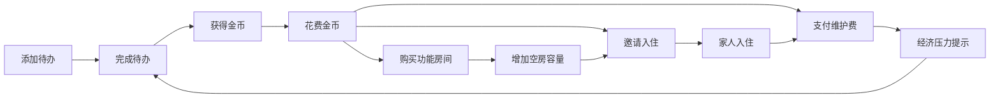
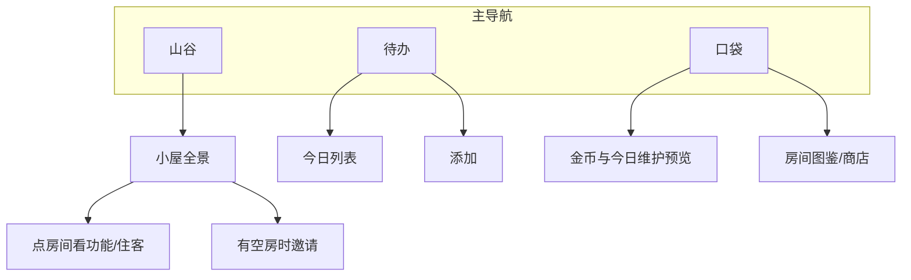

# Productivity Valley — 产品设计文档

> 状态：已批准 v0.2  
> 风格关键词：绘本画风 · 小人角色 · 简单易用 · 任务驱动的家园经营  
> 平台：Web 先行，验证后向跨端迁移

---

## 1. 产品愿景

**Productivity Valley** 是一款「完成真实待办 → 获得金币 → 经营绘本山谷」的生产力游戏。

玩家通过完成现实中的任务积累金币，用金币购买不同功能的房间、邀请家人同住、逐步把山谷扩展成小镇。游戏本身不制造压力：画面温暖、操作极简，奖励明确可见。

一句话定位：

> 把每天的小事，变成山谷里一间间亮灯的小房间。

---

## 2. 设计支柱

| 支柱 | 含义 |
|------|------|
| **真实产出驱动** | 金币主要来自完成待办，而不是刷游戏内小游戏 |
| **绘本可读性** | 像翻绘本一样一眼看懂：房间、人物、状态都有明确画面语言 |
| **负担透明** | 每个入住的人都会带来维护成本；玩家始终知道「养得起吗」 |
| **成长可扩展** | MVP 是「自家小屋」；远期是「小镇」——家人 vs 镇民的经济规则从第一天就分清 |
| **低摩擦** | 添加任务、完成任务、买房/请人，都在 1–2 步内完成 |

---

## 3. 核心循环



日常节奏：

1. 早上/随时：写下今天的待办  
2. 完成一项 → 金币叮当落下，山谷里有轻微反馈（灯光、小鸟、金币飞入钱包）  
3. 有空房 + 够钱 → 买新房间，或邀请某人入住  
4. 每日结算维护费（吃喝等）；不够则提示「山谷有点拮据」，但不惩罚式恐吓  

---

## 4. 世界结构：家 → 山谷 → 小镇

### 4.1 家（Home）— MVP 核心

玩家拥有一座小屋，由若干**房间**组成。

- 房间占用格子（见 §5）  
- **空房间**才能住人  
- 住在家里的人 = **家人（Family）**  
- 家人的吃喝等维护费由**玩家承担**

### 4.2 山谷（Valley）— 视觉舞台

绘本式俯视/斜 45° 小场景：小屋、小路、树、天气。  
山谷是情绪与反馈的主舞台，不在 MVP 做复杂探索。

### 4.3 小镇（Town）— 远期扩展

玩家可在山谷外规划地块、建房，吸引**镇民（Townsfolk）**搬入。

| | 家人 Family | 镇民 Townsfolk |
|--|-------------|----------------|
| 住哪 | 自家房间 | 镇上玩家建的房 |
| 谁养 | 玩家支付维护费 | **不需要玩家养** |
| 意义 | 温馨、陪伴、消耗与故事 | 繁荣感、解锁城镇氛围、远期社交/NPC 故事 |
| MVP | ✅ | ❌（只预留概念与数据结构扩展点） |

扩展原则：**先把「家里养人」做扎实，再开放「镇上建房」**。避免 MVP 同时做两套经济。

---

## 5. 房间系统

### 5.1 房间是什么

房间 = 可购买的功能单元，同时决定：

1. **居住容量**（能否住人、住几人）  
2. **功能加成**（对任务/金币/维护的温和 buff）  
3. **绘本画面块**（插画模块，拼进小屋）

### 5.2 MVP 房间目录（数值 v1）

| 房间 | 造价 | 容量 | 功能 | 维护相关 |
|------|------|------|------|----------|
| 起居室 | 初始免费 | 0 | 小屋必需；展示家人日常 | — |
| 卧室 | 80 | 1 | 可住人 | 住人后触发该人维护费 |
| 客房 | 100 | 1 | 可住人；入住更偏「客人」旁白 | 同卧室 |
| 厨房 | 120 | 0 | 全体家人「吃」−20% | 功能型 |
| 书房 | 150 | 0 | 完成「中/大」难度待办额外 +10% 金币 | 功能型 |
| 储藏间 | 60 | 0 | 全体「日用」−1（每人） | 功能型 |

餐厅等 P1 再加。数值依据见 §7.5 纸面模拟。

### 5.3 购买规则

- 金币足够 + 尚有建筑空位 → 可买  
- 购买后立即出现在小屋平面图/侧视图中  
- **只有带容量的房间空置时，才能邀请新人**

### 5.4 空房逻辑（关键规则）

```
可邀请人数上限 = Σ(带居住容量房间的空位数) - 当前家人数
```

赶走家人 → 房间变回空房 → 该人维护费停止；可再邀请别人。

---

## 6. 居民系统（家人）

### 6.1 身份与题材

**已定：小人绘本风**（圆脸、略夸张头身比、友善剪影；不是动物拟人主线）。

MVP 中的「人」为**预设角色卡**，例如：

| id | 名字 | 气质旁白 |
|----|------|----------|
| `milo` | 米洛 | 总把背包放在门口的旅人 |
| `nana` | 娜娜 | 会给窗台浇花的邻居 |
| `pip` | 皮普 | 安静画小人的画家 |
| `rio` | 里奥 | 天不亮就去散步的早起客 |
| `ume` | 小梅 | 爱在厨房帮忙却常打翻面粉 |
| `toby` | 托比 | 带一盏小灯来借住的夜读人 |

远期可开放自定义名字；MVP 不做人形联机。  
「接人来住」= 从角色池邀请虚拟住客。

### 6.2 邀请 / 赶走

| 动作 | 条件 | 结果 |
|------|------|------|
| 邀请 | 有空房 + 首日安家费（可选，如 20 金币） | 占用 1 容量；次日起算维护 |
| 赶走 | 任意时刻确认 | 释放房间；停止维护；角色回池（可再请） |

赶走需要二次确认，文案温和（绘本语气），例如：「要请他先去旅行一阵子吗？」

### 6.3 维护费（Maintenance）

每位家人每日产生消费，逻辑上拆成透明条目：

| 条目 | 说明 | 基础值（/人/日） |
|------|------|------------------|
| 吃 | 食物 | 8 |
| 喝 | 饮料 | 3 |
| 日用 | 杂项 | 2 |
| **合计** | | **13** |

修正：

- 厨房：吃 ×0.8  
- 储藏间：日用 −1（最低 0）  
- 有厨+储时：约 **10.4 / 人/日**（8×0.8 + 3 + 1）  
- 人数 ↑ → 总维护线性相加（MVP 不做规模经济）  
- 每日结算一次（本地时区 0 点，或当日首次打开时补结算）  
- 邀请安家费：**20** 金币（一次性）

### 6.4 金币不够付维护时

不做「游戏结束」。采用**软压力**：

1. 提示：「今天的罐头有点紧……多完成几件小事吧。」  
2. 家人表情略显忧愁（绘本表情差）  
3. 连续多日欠费 → 暂停部分房间 buff；**仍不强制赶走**  
4. 玩家可主动赶走部分家人减负  

原则：**催促行动，不羞辱用户。**

---

## 7. 待办与金币经济

### 7.1 待办

极简字段：

- 标题（必填）  
- 可选：难度（小 / 中 / 大）→ 影响金币  
- 可选：标签（专注 / 家务 / 运动…）→ 与书房等房间联动  

交互：勾选完成 → 金币飞入 → 可撤销（撤销扣回金币，已花掉则不允许撤销或进入负余额提示）。

### 7.2 金币来源（MVP）

| 来源 | 规则 |
|------|------|
| 完成待办 | 小 **10** / 中 **25** / 大 **50** |
| 书房加成 | 中/大完成时 ×1.1（四舍五入） |
| 每日首登 | **5**（安慰奖，可关） |
| 连击完成 | MVP **关闭**（降低规则噪音） |

### 7.3 金币去向

- 买房间  
- 邀请安家费（20）  
- 每日家人维护  
- （远期）镇上建房、装饰物  

### 7.4 经济目标感

理想日常：

- 独处（0 家人）：完成 1–2 件小事即可轻松买小升级  
- 2–3 家人：需要稳定完成待办才能维持，形成「为家人努力」的正向叙事  
- 养太多：维护吃紧 → 自然驱动玩家完成更多任务或精简家庭  

### 7.5 数值纸面模拟（v1）

假设玩家日均完成：小×2 + 中×1 = **45** 金币；无书房。

| 家人数 | 日维护（无厨） | 日维护（有厨+储） | 日结余（无厨） | 体感 |
|--------|----------------|-------------------|----------------|------|
| 0 | 0 | 0 | +45 | 攒钱买房 |
| 1 | 13 | ~10 | +32 / +35 | 轻松 |
| 2 | 26 | ~21 | +19 / +24 | 舒适 |
| 3 | 39 | ~31 | +6 / +14 | 要稳住节奏 |
| 4 | 52 | ~42 | −7 / +3 | 吃紧或需更大任务 |

买房节奏参考（0 家人、日入 45）：储藏间约 2 日、卧室约 2 日、厨房约 3 日、书房约 4 日。  
开局赠送：**起居室 + 金币 40**（够先买储藏间或凑卧室首付）。

---

## 8. 信息架构与关键界面

绘本风 ≠ 信息堆叠。MVP 建议 **3 个主页签**：



### 8.1 山谷页（默认首页）

- 全幅绘本场景：小屋 + 环境  
- 顶部轻量：金币 | 今日维护预估  
- 点击小屋 → 房间平面/分镜  
- **不在首屏堆统计、排行、活动条**

### 8.2 待办页

- 今日列表 + 大号「完成」点击区  
- 底部「写下一件小事」  

### 8.3 口袋页

- 金币余额  
- 「明天要花多少」维护预览（按当前家人拆开：吃/喝/日用）  
- 房间商店（卡片式图鉴，但交互必须：点一下看造价与效果，再确认购买）

### 8.4 文案语气

短句、绘本旁白感，避免系统腔。

- ✅「卧室空出来了，要不要请谁来住？」  
- ❌「ERROR: RESIDENT_SLOT_AVAILABLE」

---

## 9. 视觉与动效方向

### 9.1 绘本画风

- 柔和水彩/彩色铅笔质感，清晰角色剪影  
- 有限色板（建议：苔藓绿、暖纸色、陶土橙点缀、墨线棕）——**避免**紫粉渐变网红风、霓虹暗黑风  
- **小人角色**：圆脸、头身比偏大、肢体简洁；房间像立体绘本贴片  
- 角色辨识靠发型/衣服色块/随身物，不靠复杂五官细节  

### 9.2 动效（至少 2–3 个有意运动）

1. **完成待办**：金币弧线飞入钱包 + 小屋某一扇窗亮一下  
2. **新房间落成**：纸片展开/贴上小屋的拼贴感  
3. **家人入住**：提着小包从小路走进门  

动效服务于「被看见」，不为炫技循环播放。

### 9.3 简单易用的约束

- 主操作不超过两步  
- 少徽章、少 pill 标签墙、少悬浮贴纸  
- 空状态用插画 + 一句旁白，不用表格  

---

## 10. MVP 范围

### 10.1 必须有（P0）

- [ ] 待办：增 / 完成 / 删除；难度影响金币  
- [ ] 金币余额与获得反馈  
- [ ] 房间商店：卧室、厨房、书房、客房（+ 初始起居室）  
- [ ] 空房容量与邀请/赶走（预设角色池 ≥ 6）  
- [ ] 家人日维护（吃/喝/日用）与欠费软提示  
- [ ] 山谷 + 小屋绘本主界面  
- [ ] 本地持久化（单机即可）  

### 10.2 明确不做（MVP 非目标）

- 真实多人联机、聊天  
- 完整「小镇」地产与镇民经济（仅文档预留）  
- 战斗、PVP、排行榜  
- 复杂技能树、赛季战令  
- 强制通知骚扰  

### 10.3 下一阶段（P1）

- 更多功能房与装饰  
- 家人好感/小故事（绘本短句）  
- 标签与房间联动深化  
- **小镇地块：建房 → 镇民入住（不耗玩家维护）**  
- 云同步 / 多设备  

---

## 11. 小镇扩展（预留设计）

当「家」经济跑通后：

1. 解锁「山谷外的空地」  
2. 花费大量金币建造 **民居/店铺**（无家人维护）  
3. 镇民申请入住 → 增加繁荣度、改变山谷远景（烟囱变多、灯火）  
4. 店铺远期可产生极小被动收益（需谨慎，避免取代「做任务」主循环）  

规则锚点（写进产品记忆，避免以后做歪）：

> **家里住人 = 我养。镇上住人 = 他们自己生活，我只是房东/镇长。**

---

## 12. 数据模型草图（设计层）

便于日后实装时对齐概念，非实现承诺：

```
Player
  - coins
  - rooms[]
  - family[]          // Resident 引用，占用 room slots
  - settings

Room
  - type              // bedroom | kitchen | study | ...
  - capacity          // 0 or 1(+), MVP 以 1 为主
  - occupantId?       // null = 空房

Resident
  - id, name, portrait
  - dailyCost { food, drink, misc }
  - status            // living | traveled（被赶走）

Task
  - title, difficulty, done, createdAt, completedAt?

TownPlot (P1)
  - buildingType?
  - townsfolkId?      // 不计入 player maintenance
```

日结算伪流程：

```
due = sum(family.dailyCost after room modifiers)
if coins >= due: coins -= due; mood = content
else: coins = 0; deficit registered; mood = worried; soft debuff
```

---

## 13. 成功标准（设计验收）

一款 MVP 算「设计落地成功」，当玩家能自然说出：

1. 「我做完事就有钱。」  
2. 「有空房间才能请人来。」  
3. 「家里人越多越费钱，像多了几张吃饭的嘴。」  
4. 「以后镇上盖房，来的人不用我养。」  
5. 「画面像绘本，我不觉得复杂。」  

---

## 14. 平台策略：Web 先行 → 跨端

### 14.1 结论

| 决策 | 选择 |
|------|------|
| MVP 平台 | **Web（A）** |
| 角色题材 | **小人绘本风（B）** |
| 远期平台 | 验证核心循环后再迁 **跨端（D）** |

**要在开发过程中实时看到成效 → Web 更合适。**  
浏览器热更新、无需模拟器/签名，改完待办或房间立刻可点；跨端从第一天就会多一层构建设备成本。

### 14.2 A → D 会不会很复杂？

**中等，可控——前提是分层。**

| 层 | Web MVP | 迁到跨端时 |
|----|---------|------------|
| 规则引擎（任务、金币、房间、维护结算） | TypeScript 纯模块 | **大部复用** |
| 持久化 | `localStorage` / IndexedDB | 换成各端存储适配器 |
| UI / 绘本场景 | React DOM + CSS/Canvas | **需重做或换渲染壳**（工作量主要在这里） |
| 动效 | CSS / Web 动画 | 按端重接 |

推荐技术姿态（实装时）：

1. **`core/`**：零 UI 依赖的游戏规则与数值  
2. **`app-web/`**：Web 壳，先跑通 MVP  
3. 日后 `app-native/`（React Native）或 Flutter 壳只吃 `core`  

若选 **React → React Native**：逻辑与部分组件模式可迁移，绘本场景仍要按端适配。  
若选 **Flutter**：Web 也可跑，但生态与「改完即刷」的轻快感通常不如纯 Web 前端栈；更适合「一开始就锁定跨端」而不是「先验证玩法」。

**不建议**为了未来 D 而在 MVP 用过重跨端框架——会拖慢「看见成效」的反馈环。

### 14.3 仍可稍后定的细节

- 自定义家人名字（MVP 仅预设）  
- 是否上 PWA 安装到桌面（Web 增强，非必须）  
- 跨端具体选型（RN vs Flutter）——放到 P1 前再定  

---

## 15. 文档变更

| 版本 | 说明 |
|------|------|
| v0.1 | 首版：任务换资源、绘本风、房间/家人维护、小镇预留；产出为设计文档 only |
| v0.2 | 批准：Web 先行可迁跨端；小人题材与角色池；数值表 v1 与纸面模拟 |
